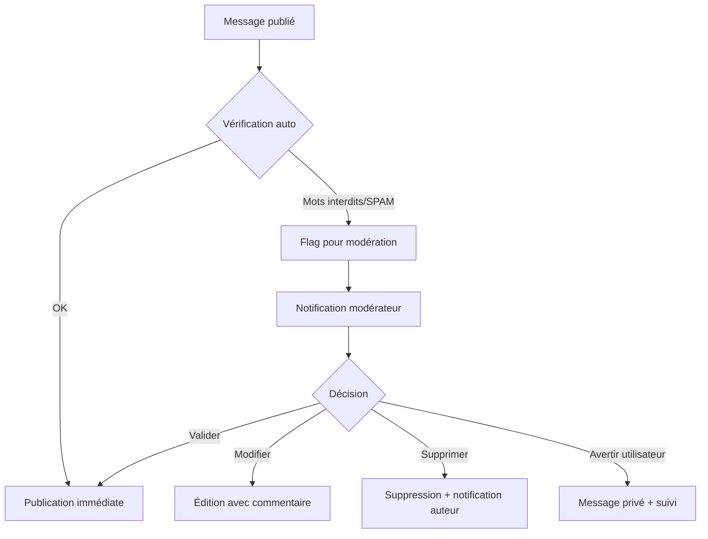

# 💬 Fonctionnalités du Module "Forum de Discussion" - Plateforme FSU

Le **Forum de Discussion** est un espace d'échange communautaire structuré, sécurisé et thématique, permettant aux acteurs du FSU de collaborer, partager leurs expériences et co-construire des solutions continentales.

Voici les fonctionnalités concrètes, alignées sur le cahier des charges :

---

## 🎯 1. OBJECTIFS DU FORUM

```
✅ Faciliter les échanges entre pairs (agences FSU, régulateurs, experts)
✅ Capitaliser les bonnes pratiques et retours d'expérience
✅ Animer la communauté autour des thématiques prioritaires (CMDT-25, réformes, financement)
✅ Créer un espace de veille collaborative et d'alerte sectorielle
✅ Renforcer la coordination continentale via des discussions structurées
```

---

## 🗂️ 2. STRUCTURE ET ORGANISATION

### Catégories thématiques principales
| Catégorie | Sous-thèmes | Public cible |
|-----------|-------------|-------------|
| **🌍 CMDT-25 & Positions africaines** | Contributions, plaidoyer, calendrier, documents stratégiques | Points focaux, Directeurs FSU, UAT |
| **⚖️ Réformes & Cadres réglementaires** | Harmonisation, compliance, études comparatives | Experts juridiques, Régulateurs |
| **💰 Financement & Partenariats** | Appels à projets, bailleurs, modèles économiques | Investisseurs, Agences FSU, Start-ups |
| **📊 Suivi & Évaluation des projets** | Indicateurs, reporting, impacts, méthodologies | Analystes, Coordinateurs projets |
| **🎓 Renforcement de capacités** | Formations, webinaires, ressources pédagogiques | Tous les membres |
| **🔧 Innovation & Technologies** | Solutions techniques, incubation, R&D | Start-ups, Opérateurs, Partenaires techniques |
| **🗣️ Espace libre / Questions-Réponses** | Entraide, suggestions, feedback plateforme | Tous les utilisateurs |

### Organisation des discussions
```
• Threads (sujets) hiérarchisés : Catégorie > Sujet > Messages > Réponses
• Tags/mots-clés pour filtrage intelligent (#CEDEAO, #RuralConnectivity, #CMDT25)
• Épinglage des sujets prioritaires par les modérateurs
• Archivage automatique des sujets inactifs > 6 mois
```

---

## ⚙️ 3. FONCTIONNALITÉS UTILISATEUR

### ✅ Création et participation
```
• Créer un nouveau sujet avec titre, catégorie, tags, description enrichie
• Répondre à un message avec formatage riche (gras, listes, liens, pièces jointes)
• Citer un message précédent pour contextualiser sa réponse
• Mentionner un utilisateur avec @nom pour notification ciblée
• Ajouter des pièces jointes (PDF, images, tableaux) ≤ 10 Mo
• Prévisualiser son message avant publication
• Enregistrer un brouillon pour reprise ultérieure
```

### ✅ Interaction et engagement
```
• "J'aime" / Réactions émotives (👍 💡 ❓ 🎯) sur les messages
• Marquer une réponse comme "Solution acceptée" (par l'auteur du sujet)
• S'abonner à un sujet pour recevoir les notifications de nouvelles réponses
• Partager un lien direct vers un sujet (avec permissions d'accès)
• Signaler un message inapproprié ou hors-sujet
```

### ✅ Recherche et navigation
```
• Moteur de recherche plein texte dans les sujets et messages
• Filtres avancés : par catégorie, date, auteur, tags, statut (résolu/non résolu)
• Tri par : pertinence, date de création, dernière activité, popularité
• Historique personnel : "Mes sujets", "Mes réponses", "Sujets suivis"
• Flux d'activité récent : "Nouveautés depuis ma dernière visite"
```

### ✅ Notifications intelligentes
```
• Notification in-app + email pour :
  - Réponse à un sujet que j'ai créé ou suivi
  - Mention @mon_nom dans un message
  - Validation/rejet de mon sujet par un modérateur
  - Nouveau sujet dans une catégorie suivie
• Paramétrage individuel : fréquence (immédiate/quotidienne/hebdo) et canaux
• Centre de notifications unifié avec marquage lu/non-lu
```

---

## 🔐 4. MODÉRATION ET GOUVERNANCE

### Rôles et permissions
| Action | Super Admin | Modérateur thématique | Utilisateur vérifié | Lecteur |
|--------|-------------|----------------------|-------------------|---------|
| Créer un sujet | ✅ | ✅ | ✅ | ❌ |
| Répondre/Commenter | ✅ | ✅ | ✅ | ❌ |
| Éditer son message | ✅ (limité) | ✅ (limité) | ✅ (< 30 min) | ❌ |
| Supprimer son message | ✅ | ✅ | ✅ (si pas de réponse) | ❌ |
| Épingler un sujet | ✅ | ✅ (sa catégorie) | ❌ | ❌ |
| Fermer/Verrouiller un sujet | ✅ | ✅ (sa catégorie) | ❌ | ❌ |
| Déplacer un sujet entre catégories | ✅ | ✅ | ❌ | ❌ |
| Modérer (éditer/supprimer) un message tiers | ✅ | ✅ (avec justification) | ❌ | ❌ |
| Bannir un utilisateur | ✅ | ❌ | ❌ | ❌ |
| Exporter des discussions | ✅ | ✅ (anonymisé) | ❌ | ❌ |

### Workflow de modération


### Charte de bonne conduite (affichée à la création de compte)
```
✅ Respect, courtoisie et professionnalisme dans les échanges
✅ Pertinence : rester dans le thème de la catégorie/sujet
✅ Confidentialité : ne pas partager d'informations sensibles non publiques
✅ Sources : citer les références quand on partage des données/chiffres
✅ Langue : privilégier FR/EN/PT selon la catégorie ; éviter le jargon excessif
❌ Pas de spam, publicité commerciale non sollicitée ou discours haineux
❌ Pas de partage de contenus protégés sans autorisation
```

---

## 🔄 5. INTÉGRATIONS AVEC LES AUTRES MODULES

```
🔗 Bibliothèque documentaire
   → Attacher un document de la bibliothèque à un sujet
   → Lien bidirectionnel : voir les discussions liées à un document

🔗 Co-rédaction
   → Lancer une discussion depuis un document en co-rédaction
   → Exporter une synthèse de discussion vers un brouillon de document

🔗 Carte interactive des projets
   → Discuter d'un projet spécifique depuis sa fiche carte
   → Filtrer les sujets du forum par pays/région/projet

🔗 Module Formation
   → Espace Q/R post-webinaire
   → Partage de ressources pédagogiques dans les discussions thématiques

🔗 Veille stratégique
   → Partager une alerte RSS dans le forum avec commentaire
   → Discussions déclenchées par une actualité sectorielle

🔗 Calendrier collaboratif
   → Créer un sujet lié à un événement (ex: "Préparation atelier CMDT-25")
   → Rappels automatiques dans les discussions avant échéances
```

---

## 📱 6. EXPÉRIENCE UTILISATEUR (UX)

### Interface principale
```
┌─────────────────────────────────────┐
│ 🔍 Rechercher dans le forum...   [+ Nouveau sujet] │
├─────────────────────────────────────┤
│ 📂 Catégories (accordion)          │
│  ▶ CMDT-25 (12 sujets actifs)      │
│  ▶ Réformes (8) • Financement (15) │
│  ▶ Suivi-Évaluation (6) • ...      │
├─────────────────────────────────────┤
│ 🔥 Sujets tendance                 │
│ • [CMDT-25] Harmonisation indicateurs... 👁️ 245 💬 18 │
│ • [Financement] Appel bailleurs Q1... 👁️ 189 💬 12 │
├─────────────────────────────────────┤
│ 🕒 Activité récente                │
│ • @Koffi_ANSUT a répondu à "Cadre CEDEAO" (2h) │
│ • Nouveau sujet: "Impact rural - SADC" par @Fatima_UAT │
└─────────────────────────────────────┘
```

### Page d'un sujet
```
┌─────────────────────────────────────┐
│ [CMDT-25] Contribution commune - Section 3.2 │
│ Tags: #indicateurs #CEDEAO #validation │
│ Créé par @PointFocal_CI • 15/04 • 24 réponses │
├─────────────────────────────────────┤
│ 👤 Message initial (enrichi, pièces jointes) │
│ [Réactions: 👍12 💡5] [Citer] [Signaler]    │
├─────────────────────────────────────┤
│ 💬 Réponses (chronologiques ou "meilleures") │
│ • @Expert_UAT: "Je propose d'ajouter..."     │
│   [Répondre] [Citer] [J'aime]               │
│ • @Admin_Pays_SN: "Données Sénégal jointes" │
│   📎 rapport_SN.pdf [Télécharger]           │
├─────────────────────────────────────┤
│ ✍️ Votre réponse [Éditeur riche]    │
│ [Joindre un fichier] [Prévisualiser] [Publier] │
└─────────────────────────────────────┘
```

### Fonctionnalités avancées
```
• Mode "Lecture seule" pour les utilisateurs non connectés (selon config)
• Version mobile optimisée : navigation simplifiée, chargement progressif
• Accessibilité : navigation clavier, contraste, lecteur d'écran compatible
• Export d'un sujet en PDF (avec filigrane si contenu sensible)
• Traduction automatique des messages (FR↔EN↔PT) via API intégrée
```

---

## 📊 7. INDICATEURS DE SUIVI ET ANALYTIQUES

Pour les administrateurs et modérateurs :
```
📈 Engagement
• Nombre de sujets créés / réponses par période
• Taux de participation par pays/CER/profil utilisateur
• Temps moyen de première réponse
• Sujets "résolus" vs. en attente

🔍 Qualité des échanges
• Taux de signalements modérés
• Satisfaction utilisateurs (sondage post-discussion)
• Réutilisation des contenus de forum (téléchargements, citations)

🌍 Impact stratégique
• Discussions ayant conduit à des documents co-rédigés
• Sujets liés aux contributions CMDT-25 finalisées
• Bonnes pratiques identifiées et capitalisées dans la bibliothèque
```

---

## 🛠️ 8. IMPLÉMENTATION TECHNIQUE (Suggestions)

```
✅ Backend
• Moteur de forum : Discourse (open source, API-first) OU solution custom avec Node.js + PostgreSQL
• Recherche : Elasticsearch pour performances et pertinence
• Cache : Redis pour chargement rapide des fils de discussion

✅ Frontend
• Framework : React/Vue.js pour interactivité temps réel
• Éditeur riche : TipTap ou CKEditor 5 avec plugins mentions/tags
• Notifications : WebSockets (Socket.io) pour mises à jour instantanées

✅ Sécurité & Conformité
• Chiffrement des messages sensibles au repos
• Journal d'audit immutable pour traçabilité des modérations
• Conformité RGPD : droit à l'oubli, export des données personnelles
• Rate limiting et protection anti-spam (reCAPTCHA, analyse comportementale)

✅ Scalabilité
• Architecture microservices pour isolation du module forum
• CDN pour pièces jointes et médias
• Backup automatique quotidien + réplication géographique
```